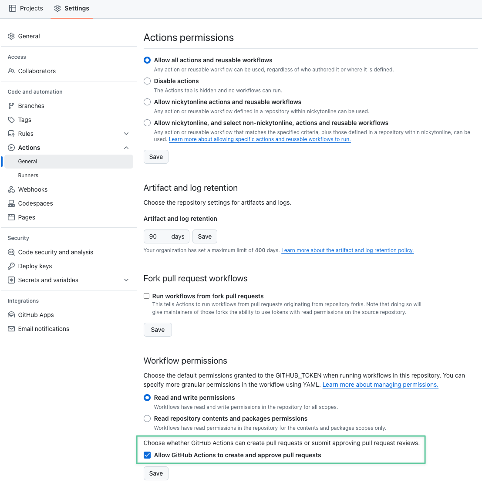

# OpenSauced Pizza GitHub Action

This action runs the OpenSauced pizza CLI in a GitHub Action workflow.

## About the Pizza CLI

For more information about the pizza-cli. check out the OpenSauced [pizza-cli](https://github.com/open-sauced/pizza-cli) repository.

## Usage

To use this action, you need to add the following to a GitHub Actions workflow file. The YAML snippet below uses the command to update your CODEOWNERS file in your repository, but replace it with whatever pizza-cli command you want to run.

```yaml
name: OpenSauced Pizza Action

on:
  schedule:
    # Run once a week on Sunday at 00:00 UTC
    - cron: "0 0 * * 0"
  workflow_dispatch: # Allow manual triggering

jobs:
  pizza-action:
    runs-on: ubuntu-latest
    steps:
      - name: Pizza Action
        uses: open-sauced/pizza-action@v2.2.0
        with:
          # optional and default is "latest". Add this parameter if you want to use a specific version, e.g. v2.0.0
          cli-version: "v2.2.0"
          # optional and false by default. Set this to true if you want to have a pull request for the changes created automatically.
          commit-and-pr: "true"
          # optional
          pr-title: "chore: update repository codeowners"
```

We suggest you add this to a workflow file in the `.github/workflows` directory of your repository and call it something like `pizza-action.yml`.

Depending on the pizza CLI command you run, different things will update. For example, if you run `pizza generate codeowners ./ --tty-disable`, it will update the CODEOWNERS file in the root of your repository.

The pizza CLI's "generate codeowners ./ --tty-disable" command requires a full repository history to accurately determine code ownership over time. Fetch-depth is set to 0 in this action to ensure all historical commits are available, allowing the command to analyze the entire project timeline and produce a comprehensive CODEOWNERS file.

## Inputs

### `cli-version`

The version of the pizza CLI to use. Default is `latest`. If using a numbered version, make sure to prefix the version number with `v`. For example, `v2.0.0`.

### `pizza-args`

Arguments to pass to the pizza CLI. Default is `generate codeowners /repository --tty-disable`.

Note: `/repository` is the path to the repository root where the pizza-cli will be run in Docker.

### `commit-and-pr`

Whether to commit the changes made by the pizza-cli and to create a pull request for the changes. Default is `false`.

### `pr-title`

Provides a custom pull request title to be used if the `commit-and-pr` option is enabled. Default is `chore (automated): OpenSauced updates`.

## Troubleshooting

One common isssue is the following error, `pull request create failed: GraphQL: GitHub Actions is not permitted to create or approve pull requests (createPullRequest)`. To fix this, check _Allow GitHub Actions to create and approve pull requests_ in the repository settings under the actions section.


